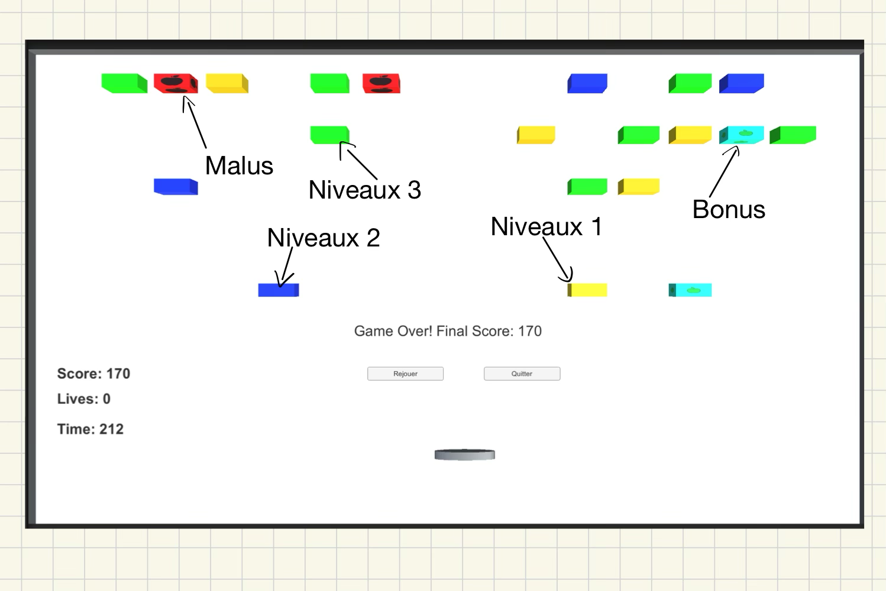

# Breakout Game

Ce projet est un jeu de type Breakout réalisé avec Unity. Le but du jeu est de détruire des briques avec une balle tout en empêchant celle-ci de tomber en dehors du terrain.

## Table des Matières

- [Aperçu](#aperçu)
- [Installation](#installation)
- [Commandes](#commandes)
- [Fonctionnalités](#fonctionnalités)
- [Scripts](#scripts)
- [Préfabriqués](#préfabriqués)
- [Crédits](#crédits)

## Aperçu



## Installation

1. **Cloner le dépôt :**
    ```sh
    git clone https://github.com/yourusername/breakout-game.git
    ```
2. **Ouvrir le projet dans Unity :**
    - Ouvrez Unity Hub.
    - Cliquez sur "Add" et sélectionnez le dossier du projet.

3. **Configurer les préfabriqués :**
    - Assurez-vous que tous les préfabriqués nécessaires sont assignés dans l'inspecteur pour l'objet `GameManager`.

## Commandes

- **Déplacer le paddle :** Utilisez les touches `A` (gauche) et `D` (droite).
- **Lancer la balle :** Appuyez sur la touche `Space`.

## Fonctionnalités

- **Briques de différents niveaux :** Les briques de niveau 1, 2 et 3 nécessitent respectivement 1, 2 et 3 coups pour être détruites.
- **Briques malus et bonus :** Les briques malus diminuent le score de 20 points et les briques bonus augmentent le score de 20 points. Elles apparaissent moins fréquemment que les briques normales.
- **Score et vies :** Le score augmente à chaque coup sur une brique. Le joueur commence avec 3 vies.
- **Timer :** La partie dure 300 secondes. Le score final est affiché à la fin de la partie.

## Scripts

### PaddleController.cs

Script pour contrôler le paddle, permettant de le déplacer horizontalement avec les touches `A` et `D`, tout en limitant son mouvement entre des positions `minX` et `maxX`.

### BallController.cs

Script pour contrôler la balle. La balle est lancée en appuyant sur `Space`. La vitesse de la balle est constante et elle rebondit sur les briques et les murs.

### Brick.cs

Script pour les briques. Gère les niveaux des briques, les changements de couleur en fonction des coups restants, et la destruction des briques.

### GameManager.cs

Script de gestion du jeu. Gère le score, les vies, le timer, et la génération aléatoire de nouvelles briques. Gère également les briques malus et bonus.

## Préfabriqués

- **BrickLevel1** : Brique de niveau 1.
- **BrickLevel2** : Brique de niveau 2.
- **BrickLevel3** : Brique de niveau 3.
- **BrickMalus** : Brique malus, diminue le score de 20 points.
- **BrickBonus** : Brique bonus, augmente le score de 20 points.
- **Paddle** : Paddle contrôlé par le joueur.
- **Ball** : Balle lancée par le joueur.

## Crédits

- **Développement** : Votre nom
- **Graphismes** : Source des assets graphiques, si applicable
- **Sons** : Source des effets sonores, si applicable

---

Ce projet a été réalisé dans le cadre d'un apprentissage de Unity. Toute contribution ou suggestion est la bienvenue !
